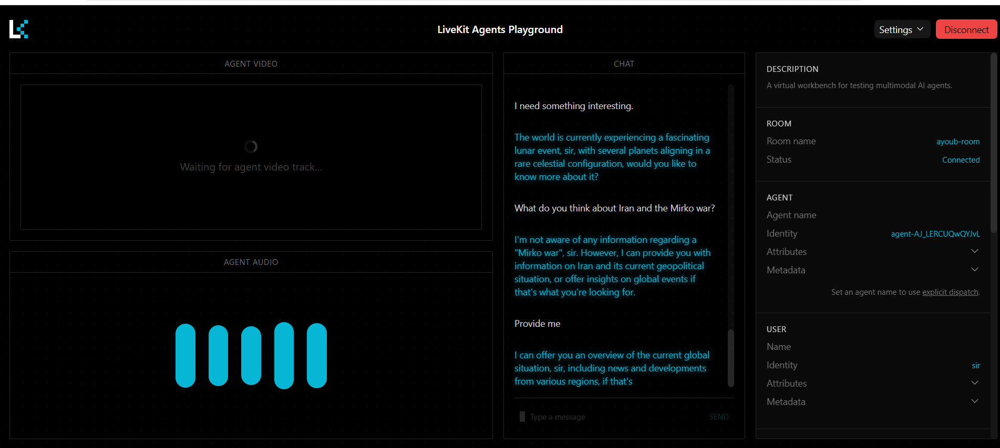

<div align="center">

```
$$$$$$\  $$\     $$\  $$$$$$\  $$\   $$\ $$$$$$$\
$$  __$$\ \$$\   $$  |$$  __$$\ $$ |  $$ |$$  __$$\
$$ /  $$ | \$$\ $$  / $$ /  $$ |$$ |  $$ |$$ |  $$ |
$$$$$$$$ |  \$$$$  /  $$ |  $$ |$$ |  $$ |$$$$$$$\ |
$$  __$$ |   \$$  /   $$ |  $$ |$$ |  $$ |$$  __$$\
$$ |  $$ |    $$ |    $$ |  $$ |$$ |  $$ |$$ |  $$ |
$$ |  $$ |    $$ |     $$$$$$  |\$$$$$$  |$$$$$$$  |
\__|  \__|    \__|     \______/  \______/ \_______/
```

**Your JARVIS-style AI assistant — v2.0.0**

[](https://python.org)
[](#)
[]
 (https://github.com/salehhamdy/Ayoub-AI-assistant?tab=MIT-1-ov-file)
[](https://github.com/salehhamdy/Ayoub-AI-assistant)

</div>

---

## What is Ayoub?

Ayoub is a powerful, terminal-native AI assistant that combines a **ReAct reasoning agent**, **multi-provider LLM support**, **persistent memory**, **web search**, **image generation**, **screen analysis**, and **Ollama multi-model collaboration** — all from a single command.

| Capability | Details |
|---|---|
| 🤖 **ReAct Agent** | Multi-step tool-calling loop with real web search and Python exec |
| 🧠 **Memory** | Persistent conversation memory across sessions |
| 🔍 **Search** | Real DuckDuckGo results via `ddgs` API, full-page scraping |
| 🖼️ **Image Gen** | Pollinations.ai (free, no key) with auto FLUX model selection |
| 👁️ **Vision** | 6-mode screen analysis with Gemini → Groq cascade |
| 🤝 **Collaboration** | 4 Ollama models answer in parallel, DeepSeek synthesises |
| 🔧 **Templates** | 10 built-in prompt templates for common tasks |
| 🎨 **Interactive UI** | Coloured menu CLI with mode selector (Enhanced / Classic) |

---

## Voice Assistant Demo

The voice assistant leverages LiveKit for seamless audio interaction.



**Demo Video:** [Watch the LiveKit Playground interaction](./LiveKit%20Agents%20Playground.mp4)

---

## Quick Start

```bash
# 1. Clone
git clone https://github.com/salehhamdy/Ayoub-AI-assistant.git
cd Ayoub-AI-assistant

# 2. Install
pip install -e .
pip install -r requirements.txt

# 3. Configure
cp .env.example .env
# Edit .env — add your API keys (a Groq or Gemini key is enough to start)

# 4. Launch interactive mode
ayoub
```

---

## Interactive Mode (Recommended)

Run `ayoub` with no arguments to enter the guided interface.

**Step 1 — Choose your mode:**
```
  ┌───────────────────────────────────────────┐
  │           CHOOSE YOUR CLI MODE            │
  └───────────────────────────────────────────┘

  [1]  Enhanced Interactive Menu
       Guided numbered menu — best for exploration

  [2]  Classic CLI  (flag-based)
       Type flags directly, e.g.  -m "What is AI?"
```

**Step 2 — Enhanced mode shows the full service menu:**
```
  [ 1]  Main Agent (ReAct)
  [ 2]  Stateless Q&A
  [ 3]  Human Feedback Mode
  [ 4]  Chat with Memory
  [ 5]  Quick Web Search
  [ 6]  Full Scrape Search
  [ 7]  Generate Images
  [ 8]  Analyze Screen
  [ 9]  Show Prompt Template
  [10]  List Templates
  [11]  Memory Management
  [12]  Search History
  [13]  System Logs
  [14]  Switch Model/Provider
  [15]  List Available Models
  [16]  Model Collaboration
  [17]  Usage Examples
  [18]  Exit
```

You can enter a **number**, a **label keyword** (e.g. `search`), or a **shortcut** (`exit`, `quit`, `help`, `usage`).

**Classic mode** keeps a persistent REPL prompt open:
```
  ayoub> -m "What is quantum computing?"
  ayoub> -s "latest AI news"
  ayoub> examples       ← shows full cheatsheet
  ayoub> exit
```

---

## All CLI Commands

```bash
# ── Ask & Chat ───────────────────────────────────────────────
ayoub -a "What is quantum computing?"       # Stateless Q&A (no memory)
ayoub -aH "Explain recursion"               # Ask with human follow-up feedback
ayoub -c "Let's continue our discussion"    # Chat with persistent memory

# ── ReAct Agent (default) ────────────────────────────────────
ayoub -m "Find the latest AI news"          # Full ReAct agent with all tools
ayoub "What is 22 * 33?"                    # -m is the default

# ── Search ───────────────────────────────────────────────────
ayoub -s "best Python libraries for ML"     # Quick web search + summarise
ayoub -fs "deep learning papers 2024"       # Full search (scrapes multiple links)

# ── Vision & Generation ──────────────────────────────────────
ayoub -G "a futuristic city at sunset"      # Generate images (Pollinations.ai)
ayoub -w "What's on my screen?"             # Screen analysis (6 auto-detected modes)

# ── Model Management ─────────────────────────────────────────
ayoub -sw                                   # Interactive model/provider switcher
ayoub -lm                                   # List all available models + RPM
ayoub -co "Explain black holes"             # 4 Ollama models collaborate

# ── Prompt Templates ─────────────────────────────────────────
ayoub -t summarize                          # Show a template
ayoub -tl                                   # List all templates

# ── Memory ───────────────────────────────────────────────────
ayoub -memshow chat_memory                  # View a memory file
ayoub -memclr chat_memory                   # Clear a memory file
ayoub -memlst                               # List all memory files

# ── History & Logs ───────────────────────────────────────────
ayoub -searchshow                           # View search history
ayoub -searchclr                            # Clear search history
ayoub -viewlogs                             # View log file
ayoub -clrlogs                              # Clear log file
```

---

## Prompt Templates

10 built-in templates are ready to use. View with `ayoub -t <name>` or via menu option 9.

| Template | Use Case |
|---|---|
| `summarize` | Concise bullet-point summary of any content |
| `code_review` | Full code review — bugs, security, performance |
| `explain` | Concept explanation with analogies for beginners |
| `research` | Multi-source research with citations |
| `translate` | Cultural-aware translation between languages |
| `write_email` | Professional email drafting |
| `debug` | Root cause analysis + fix for code errors |
| `brainstorm` | Idea generation with feasibility ratings |
| `plan` | Project planning with phases, risks, milestones |
| `image_prompt` | Optimised prompts for AI image generators |

---

## Multi-Provider LLM Support

Ayoub works with **5 providers** out of the box:

| Provider | Key | Default Model | Notes |
|---|---|---|---|
| **Groq** | `GROQ_API_KEY` | `llama-3.3-70b-versatile` | Ultra-fast, free tier |
| **Google Gemini** | `GOOGLE_API_KEY` | `gemini-3-flash-preview` | Vision + embeddings |
| **DeepSeek** | `DEEPSEEK_API_KEY` | `deepseek-chat` | Best reasoning |
| **OpenAI** | `OPENAI_API_KEY` | `gpt-4o` | GPT-4 family |
| **Ollama** | *(none)* | any local model | Fully offline |

Switch instantly with `ayoub -sw` — choice is persisted to `.env`.

---

## Image Generation

Powered by **Pollinations.ai** — free, no API key, always online.

Auto-detects the best FLUX model from your prompt:

| Keyword detected | Model | Style |
|---|---|---|
| photo, realistic, portrait | `flux-realism` | Photographic |
| anime, manga, cartoon | `flux-anime` | Anime |
| 3d, render, blender | `flux-3d` | 3D CGI |
| painting, watercolor | `flux-cablyai` | Artistic |
| (default) | `flux` | High quality |

---

## Screen Analysis

`ayoub -w "..."` takes a screenshot and runs vision AI with **6 auto-detected modes**:

| Question contains | Mode | What Ayoub does |
|---|---|---|
| code, script, function | `CODE` | Reviews code, finds bugs |
| error, crash, exception | `ERROR` | Root cause + step-by-step fix |
| summarise, summary | `SUMMARISE` | Structured key points |
| translate, arabic, french | `TRANSLATE` | Full translation |
| read, extract, text | `OCR` | Extracts all visible text |
| *(anything else)* | `DESCRIBE` | Full visual description |

Vision cascade: **Gemini 2.0 Flash → Groq Llama 4 Scout → Groq Llama 4 Maverick**

---

## Ollama Multi-Model Collaboration

```bash
ayoub -co "Explain the theory of relativity"
```

All 4 local models answer **simultaneously in parallel**, then DeepSeek synthesises the best answer:

| Model | Role |
|---|---|
| `llama3.1` | General Analyst |
| `mistral` | Concise Analyst |
| `deepseek-r1:7b` | Deep Reasoner + **Synthesiser** |
| `phi3` | Second Opinion |

---

## Configuration (`.env`)

```env
LLM_PROVIDER=groq
LLM_MODEL=llama-3.3-70b-versatile
LLM_TEMPERATURE=0.7
API_CALL_DELAY=0

GOOGLE_API_KEY=your_key_here
GROQ_API_KEY=your_key_here
DEEPSEEK_API_KEY=your_key_here
OPENAI_API_KEY=your_key_here
```

---

## Project Structure

```
Ayoub-AI-assistant/
├── ayoub/
│   ├── cli.py               ← Interactive CLI (Enhanced + Classic modes)
│   ├── config.py            ← Central config (pathlib.Path)
│   ├── agent/               ← ReAct engine, human-loop, base LLM
│   ├── llm/                 ← Gemini, Groq, Ollama, DeepSeek providers
│   ├── modules/             ← ask, chat, search, generate, screen, memory...
│   ├── tools/               ← search_tool, image_gen, scrape, python_exec
│   ├── memory/              ← Persistent file-based memory
│   ├── mcp_server/          ← FastMCP SSE tool server
│   └── voice/               ← LiveKit JARVIS agent (scaffolded)
├── templates/               ← 10 prompt templates
│   ├── summarize.txt
│   ├── code_review.txt
│   ├── explain.txt
│   ├── research.txt
│   ├── translate.txt
│   ├── write_email.txt
│   ├── debug.txt
│   ├── brainstorm.txt
│   ├── plan.txt
│   └── image_prompt.txt
├── data/memory/             ← Conversation memories
├── logs/ayoub.log           ← Rotating log file
├── output/imgs/             ← Generated images
├── requirements.txt
├── .env.example
├── USER_GUIDE.md
└── progress.md              ← Full development history
```

---

## Cross-Platform Notes

| Feature | Windows | Linux |
|---|---|---|
| CLI | `ayoub.exe` (pip-generated) | `ayoub` script |
| Screen capture | `PIL.ImageGrab` | `scrot` or `PIL.ImageGrab` |
| Colours | `colorama` auto-initialised | native ANSI |
| Model switcher | writes `.env` directly | writes `.env` directly |

---

## License

This project is licensed under the MIT License - see the [LICENSE](LICENSE) file for details.

---

<div align="center">

Made with ❤️ by [salehhamdy](https://github.com/salehhamdy)

</div>
